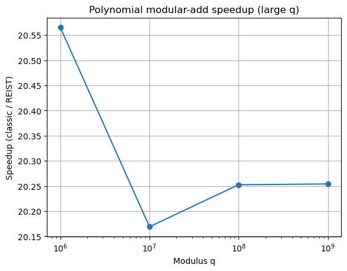

# REIST

Dieses Projekt zeigt sehr deutlich, wie viel Leistung man aus ganz normalen Operationen holen kann, wenn man den Blickwinkel ändert. REIST („Remainder Equalized Integer Symmetric Transform“) ersetzt klassische Modulo-Operationen (%), die auf jeder CPU teuer sind, durch eine viel einfachere und schnellere Darstellung des Restes.  

Das klingt am Anfang abstrakt, ist aber letztlich einfach:  
Anstatt eine Division zu machen, korrigiert REIST das Ergebnis nur über **Addieren, Vergleichen und ±B**. Diese einfachen ALU-Operationen sind extrem schnell – und genau das sieht man in den Benchmarks.

Ziel dieses Repositories ist es, REIST verständlich, reproduzierbar und anhand praktischer Beispiele zu demonstrieren.

---

# 1. Was ist REIST – in einfachen Worten

Normalerweise wird ein Wert modulo B reduziert, indem man eine echte Division macht:

```
r = (r + k) % B
```

Bei großen B kostet das Zeit, weil der Prozessor dafür die **IDIV**-Einheit verwendet. Das ist eine der langsamsten Operationen in der CPU.

REIST macht etwas anderes:

- Der Wertebereich wird symmetrisch dargestellt: `(-B/2, B/2]`
- Überschreitet ein Wert die Grenze, wird nur mit **±B** korrigiert
- Es findet **keine Division** statt
- Alles läuft über einfache Integer-Operationen (Add, Compare, Branchless-Korrektur)

Das Ergebnis ist mathematisch gleichwertig – aber viel schneller.

---

# 2. Warum das für die Praxis relevant ist

Sehr viele Bereiche arbeiten intern mit Modulo-Operationen:

- Kryptographie (z. B. Ringarithmetik, Zähler, Key-Mixing)
- Hashing (Tabellenindex, PRNG-Steps)
- Datenstrukturen
- Signalverarbeitung
- Zahlentheorie-Berechnungen
- Counter-Mechanismen in Block- und Stream-Cipher

Und in all diesen Bereichen entstehen teure `%`-Operationen, die massiv bremsen können. Wenn man das eliminiert, gewinnt man Geschwindigkeit – und zwar deutlich.

---

# 3. Ergebnisse aus den Benchmarks

Die Benchmarks in diesem Repo zeigen genau das:

## 3.1 Periodisches Modulo („r = (r + k) % B“)  
→ **REIST ist ca. 3,7× bis 3,8× schneller** als die klassische Modulo-Version  
→ unabhängig davon, ob B klein oder groß ist  
→ die Diagramme zeigen eine fast flache Speedup-Kurve um ~3,75×

Das bedeutet:  
Wenn ein Programm viel „r = (r + k) % B“ nutzt, hat man hier einen klaren Vorteil.

---

## 3.2 Polynomial Arithmetic (NTRU-Stil, große Moduli wie in PQC)
→ **REIST ist ~20× schneller**  
→ konstantes Verhalten über alle getesteten q-Werte  
→ diese Art von Operation ist sehr typisch in Post-Quantum-Kryptosystemen

Das ist eine extrem starke Zahl:  
Ein Speedup um den Faktor 20 ist nicht nur „nett“, sondern wirklich ein Gamechanger.

---

## 3.3 Kleine Moduli (z. B. 257)
Hier sieht man **keinen Vorteil**.  
Warum?  
Weil der Compiler kleine Moduli sowieso optimiert. Da hat REIST nichts mehr zu holen.

---

## 3.4 ChaCha20 / Stream-Cipher
ChaCha nutzt **keine Modulo-Reduktion**, sondern nur Add, XOR, Rotationen.  
Darum **bringt REIST dort keinen Vorteil**, und das zeigen die Benchmarks korrekt.

---

# 4. Was die Diagramm zeigen

### Diagramm 1: Modular-Add Speedup

- Horizontale Achse: Modulus B (von 257 bis 1.000.000.007)
- Vertikale Achse: Speedup (classic / REIST)
- Fast horizontale Linie bei ~3,75×

Das zeigt:  
Der REIST-Vorteil ist **robust, stabil und unabhängig vom Modulus**.

---

### Diagramm 2: Polynomial Speedup

- Modulus q in logarithmischer Darstellung
- Speedup konstant bei ~20×

Das zeigt:  
Große Moduli sind für REIST das perfekte Einsatzgebiet – die Division fliegt raus, und das macht alles richtig schnell.

---

# 5. Benchmarks ausführen

Die Benchmarks liegen als einzelne Dateien in `src/`.  
Mit dem beigefügten Makefile kann man alles automatisch bauen und laufen lassen:

```
make -j8
make run
```

Die Ergebnisse werden in der Konsole ausgegeben und in CSV-Dateien gespeichert – perfekt um eigene Diagramme zu erzeugen.

---

# 6. Für wen ist das Projekt interessant?

- Entwickler, die Performance aus numerischen Loops holen wollen  
- Kryptographen, die teure Modulo-Operationen vermeiden möchten  
- FPGA-/ASIC-Entwickler (REIST ist hardwareseitig noch viel stärker)  
- Leute, die wissenschaftliche Konzepte praktisch nachvollziehen wollen  
- Studierende, die sich mit Zahlendarstellung auseinandersetzen  
- Jeder, der gerne Benchmarks analysiert  

---

# 7. Fazit

REIST ersetzt Division durch einfache Integer-Rechenoperationen und ist in vielen praktischen Szenarien **deutlich schneller**. Besonders bei großen Moduli erreicht man Beschleunigungen von bis zu **20×**, was man sonst nur mit komplett neuen Algorithmen oder spezialisierten Hardwareeinheiten sieht.

Die Benchmarks hier im Repository machen das Konzept klar nachvollziehbar, reproduzierbar und leicht verständlich. Es ist ein gutes Beispiel dafür, wie Ideen aus der Zahlentheorie, Systemarchitektur und Softwareoptimierung zusammengeführt werden können.

---

# 8. Lizenz

Das Projekt steht unter der MIT-Lizenz und kann beliebig erweitert oder in eigenen Arbeiten verwendet werden.

