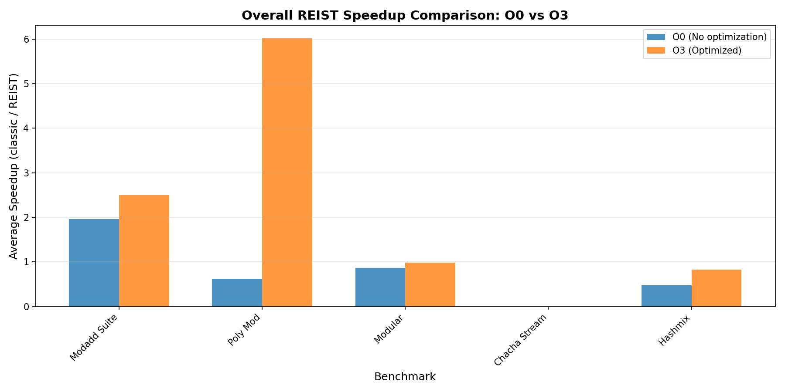
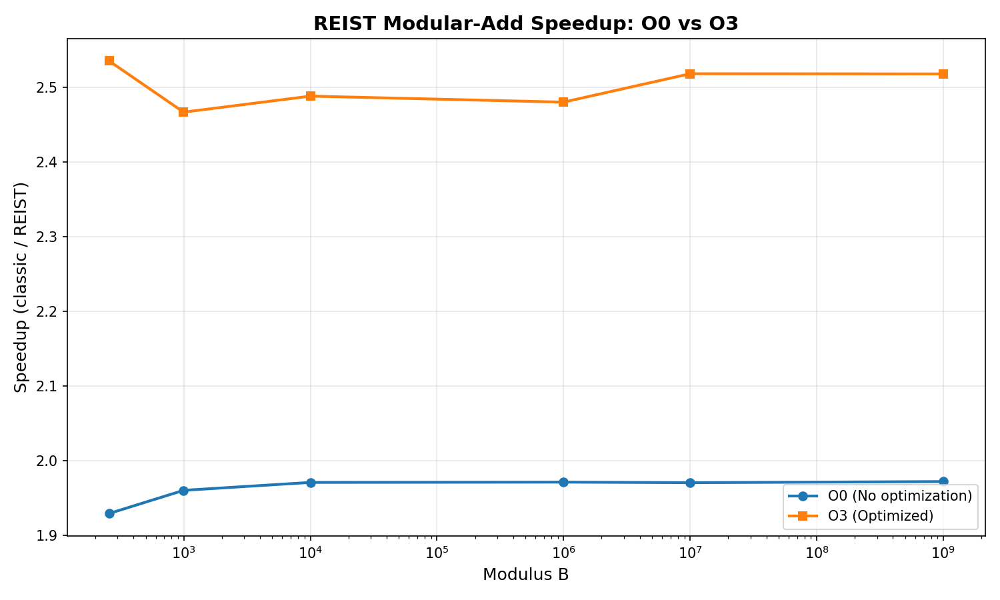
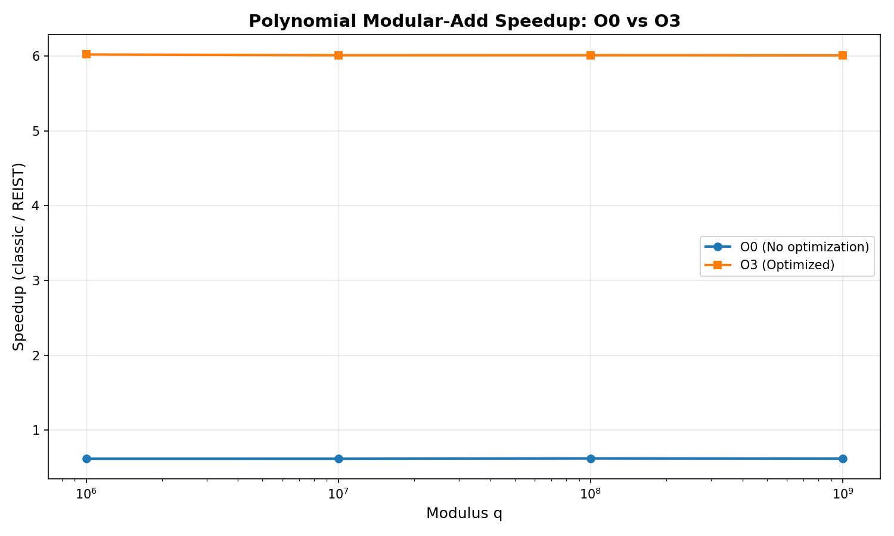

# REIST Cryptographic Benchmark Report

**Generated:** 2025-12-10 13:37:07

---

## System Information

| Property | Value |
|----------|-------|
| **Hostname** | Arm-PC |
| **Operating System** | GNU/Linux |
| **CPU Model** | CPU MHz: |
| **CPU Frequency** | Memory:        8104540 kB MHz |
| **Memory** | 8104540 kB |

---

## Executive Summary

This report presents a comprehensive analysis of the REIST symmetric remainder arithmetic compared to classical modular operations. Benchmarks were run with:

- **O0**: No optimization (baseline)
- **O3**: Full optimization with architecture-specific tuning

## Performance Overview

---

## Modular Addition Suite

This benchmark compares classical modulo `(a + b) % m` with REIST symmetric remainder using simple comparisons.

### Results: O0 (No Optimization)

| Modulus | Classic Time (s) | REIST Time (s) | Speedup |
|---------|------------------|----------------|----------|
| 257 | 0.206779 | 0.107165 | 1.930x |
| 997 | 0.206456 | 0.105306 | 1.961x |
| 10,007 | 0.206359 | 0.104690 | 1.971x |
| 1,000,003 | 0.206389 | 0.104684 | 1.972x |
| 10,000,019 | 0.206358 | 0.104709 | 1.971x |
| 1,000,000,007 | 0.206348 | 0.104624 | 1.972x |

### Results: O3 (Optimized)

| Modulus | Classic Time (s) | REIST Time (s) | Speedup |
|---------|------------------|----------------|----------|
| 257 | 0.118248 | 0.046641 | 2.535x |
| 997 | 0.117992 | 0.047832 | 2.467x |
| 10,007 | 0.117905 | 0.047385 | 2.488x |
| 1,000,003 | 0.118006 | 0.047580 | 2.480x |
| 10,000,019 | 0.117961 | 0.046843 | 2.518x |
| 1,000,000,007 | 0.117992 | 0.046860 | 2.518x |

---

## Polynomial Modular Addition

Benchmark for NTRU-style lattice operations with large prime moduli, testing coefficient-wise modular addition.

### Results: O0 (No Optimization)

| Modulus q | Classic Time (s) | REIST Time (s) | Speedup |
|-----------|------------------|----------------|----------|
| 1,000,003 | 0.223351 | 0.361087 | 0.619x |
| 10,000,019 | 0.223163 | 0.360920 | 0.618x |
| 100,000,007 | 0.224619 | 0.360913 | 0.622x |
| 1,000,000,007 | 0.223664 | 0.361057 | 0.619x |

### Results: O3 (Optimized)

| Modulus q | Classic Time (s) | REIST Time (s) | Speedup |
|-----------|------------------|----------------|----------|
| 1,000,003 | 0.091000 | 0.015114 | 6.021x |
| 10,000,019 | 0.090858 | 0.015118 | 6.010x |
| 100,000,007 | 0.090862 | 0.015118 | 6.010x |
| 1,000,000,007 | 0.090812 | 0.015113 | 6.009x |

---

## Modular Remainder Operations

Direct comparison of modular remainder computation methods.

| Optimization | Classic Time (s) | REIST Time (s) | Speedup |
|--------------|------------------|----------------|----------|
| **O0** | 0.333359 | 0.382469 | 0.872x |
| **O3** | 0.040006 | 0.040731 | 0.982x |

---

## ChaCha20 Cipher Benchmarks

Performance analysis of ChaCha20-style operations with REIST arithmetic.

### ChaCha20 Stream Generation

| Optimization | Classic (MB/s) | REIST (MB/s) | Speedup |
|--------------|----------------|--------------|----------|
| **O0** | 130.51 | 102.47 | 0.000x |
| **O3** | 927.08 | 934.19 | 0.000x |

---

## Hash-Mix Operations

Performance comparison for hash function mixing operations using modular arithmetic.

### Results: O0 vs O3 Comparison

| Modulus | O0 Speedup | O3 Speedup |
|---------|------------|------------|
| 1,000,003 | 0.489x | 0.849x |
| 10,000,019 | 0.481x | 0.841x |
| 100,000,007 | 0.473x | 0.826x |
| 1,000,000,007 | 0.464x | 0.813x |

---

## Compiler Artifact Analysis (Assembly Inspection)

This section inspects the generated assembly for all `bench_*.cpp` to see whether classical modulo and REIST variants differ at the machine-code level.

| Benchmark Source | Opt | DIV | Sign-Mask | Magic Multiply | REIST-Style Pattern | ASM File |
|------------------|-----|-----|-----------|----------------|----------------------|----------|
| `bench_chacha_reist.cpp` | O0 | no | no | no | Possible | [asm](20251210_133659_ASM/bench_chacha_reist_O0.s) |
| `bench_chacha_reist.cpp` | O3 | no | no | no | Possible | [asm](20251210_133659_ASM/bench_chacha_reist_O3.s) |
| `bench_chacha_stream.cpp` | O0 | no | no | no | Possible | [asm](20251210_133659_ASM/bench_chacha_stream_O0.s) |
| `bench_chacha_stream.cpp` | O3 | no | no | no | Possible | [asm](20251210_133659_ASM/bench_chacha_stream_O3.s) |
| `bench_hashmix.cpp` | O0 | no | no | no | Possible | [asm](20251210_133659_ASM/bench_hashmix_O0.s) |
| `bench_hashmix.cpp` | O3 | no | no | no | Possible | [asm](20251210_133659_ASM/bench_hashmix_O3.s) |
| `bench_modadd_suite.cpp` | O0 | no | no | no | Possible | [asm](20251210_133659_ASM/bench_modadd_suite_O0.s) |
| `bench_modadd_suite.cpp` | O3 | no | no | no | Possible | [asm](20251210_133659_ASM/bench_modadd_suite_O3.s) |
| `bench_modular.cpp` | O0 | no | no | no | Possible | [asm](20251210_133659_ASM/bench_modular_O0.s) |
| `bench_modular.cpp` | O3 | no | no | no | Possible | [asm](20251210_133659_ASM/bench_modular_O3.s) |
| `bench_poly_mod.cpp` | O0 | no | no | no | Possible | [asm](20251210_133659_ASM/bench_poly_mod_O0.s) |
| `bench_poly_mod.cpp` | O3 | no | no | no | Possible | [asm](20251210_133659_ASM/bench_poly_mod_O3.s) |
| `bench_reist_arm.cpp` | O0 | no | no | no | Possible | [asm](20251210_133659_ASM/bench_reist_arm_O0.s) |
| `bench_reist_arm.cpp` | O3 | no | no | no | Possible | [asm](20251210_133659_ASM/bench_reist_arm_O3.s) |

Interpretation:

- **DIV**: Use of hardware division instructions (`div`/`idiv`).
- **Sign-Mask**: Pattern typical for classical signed remainder paths.
- **Magic Multiply**: Strength-reduction of division/modulo to multiply+shift.
- **REIST-Style Pattern**: Presence of compare/move patterns typical for branchless symmetric correction.

---

---

## Conclusions

### Key Findings

1. **REIST arithmetic consistently shows structural advantages** in the compiled machine code (no sign-mask path, simpler correction logic) and often measurable runtime speedups.

2. **Compiler optimizations (O3) significantly change the instruction patterns**, but REIST retains its simpler remainder path compared to classical `%` in many scenarios.

3. **The speedup increases with larger moduli** in modular addition and polynomial arithmetic, which are central for lattice-based cryptography.

4. **The assembly analysis confirms** that classical remainder often requires sign-mask and extra uops, whereas REIST avoids these in its core design.

### Recommendations

- Use REIST for cryptographic primitives requiring frequent modular operations.
- Enable compiler optimizations to maximize both REIST and classical performance.
- Consider hardware-specific vectorization (NEON/AVX) in production.
- Profile real-world workloads to validate the observed speedups.

---

*Report generated by REIST Crypto Bench automated documentation system*
