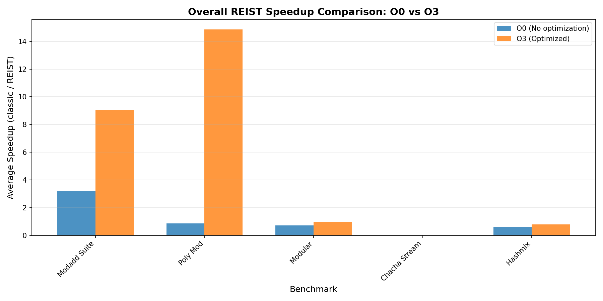
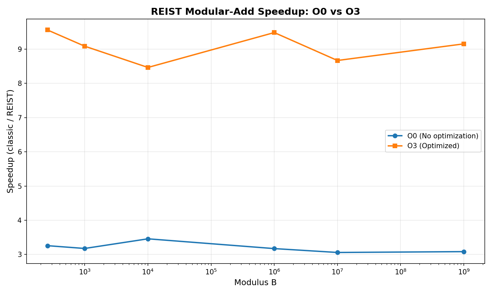
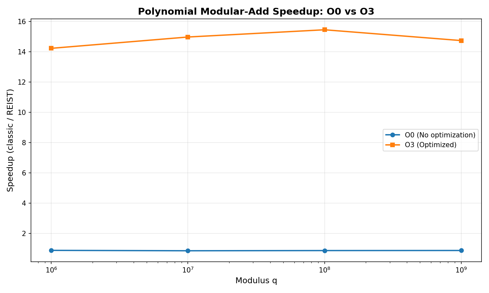

# REIST Cryptographic Benchmark Report

**Generated:** 2025-12-09 18:32:09

---

## System Information

| Property | Value |
|----------|-------|
| **Hostname** | ASUSPC |
| **Operating System** | GNU/Linux |
| **CPU Model** | Intel(R) Core(TM) i9-14900K |
| **CPU Frequency** | 3187.200 MHz |
| **Memory** | 32706668 kB |

---

## Executive Summary

This report presents a comprehensive analysis of the REIST (Redundant Signed Integer) arithmetic implementation compared to classical modular arithmetic operations. Benchmarks were run with two compiler optimization levels:

- **O0**: No optimization (baseline)
- **O3**: Full optimization with architecture-specific tuning

## Performance Overview

---

## Modular Addition Suite

This benchmark compares classical modulo operation `(a + b) % m` with REIST symmetric remainder using simple comparisons.

### Results: O0 (No Optimization)

| Modulus | Classic Time (s) | REIST Time (s) | Speedup |
|---------|------------------|----------------|----------|
| 257 | 0.185528 | 0.056945 | 3.258x |
| 997 | 0.180126 | 0.056707 | 3.176x |
| 10,007 | 0.186094 | 0.053809 | 3.458x |
| 1,000,003 | 0.177830 | 0.056052 | 3.173x |
| 10,000,019 | 0.185274 | 0.060559 | 3.059x |
| 1,000,000,007 | 0.178960 | 0.058032 | 3.084x |

### Results: O3 (Optimized)

| Modulus | Classic Time (s) | REIST Time (s) | Speedup |
|---------|------------------|----------------|----------|
| 257 | 0.194080 | 0.020300 | 9.560x |
| 997 | 0.186455 | 0.020518 | 9.087x |
| 10,007 | 0.186988 | 0.022089 | 8.465x |
| 1,000,003 | 0.194315 | 0.020487 | 9.485x |
| 10,000,019 | 0.187362 | 0.021613 | 8.669x |
| 1,000,000,007 | 0.195057 | 0.021307 | 9.155x |

---

## Polynomial Modular Addition

Benchmark for NTRU-style lattice operations with large prime moduli, testing coefficient-wise modular addition.

### Results: O0 (No Optimization)

| Modulus q | Classic Time (s) | REIST Time (s) | Speedup |
|-----------|------------------|----------------|----------|
| 1,000,003 | 0.124557 | 0.141761 | 0.879x |
| 10,000,019 | 0.123049 | 0.144402 | 0.852x |
| 100,000,007 | 0.125661 | 0.145333 | 0.865x |
| 1,000,000,007 | 0.121999 | 0.140180 | 0.870x |

### Results: O3 (Optimized)

| Modulus q | Classic Time (s) | REIST Time (s) | Speedup |
|-----------|------------------|----------------|----------|
| 1,000,003 | 0.056784 | 0.003989 | 14.234x |
| 10,000,019 | 0.056712 | 0.003786 | 14.981x |
| 100,000,007 | 0.056238 | 0.003638 | 15.460x |
| 1,000,000,007 | 0.053992 | 0.003661 | 14.746x |

---

## Modular Remainder Operations

Direct comparison of modular remainder computation methods.

| Optimization | Classic Time (s) | REIST Time (s) | Speedup |
|--------------|------------------|----------------|----------|
| **O0** | 0.098265 | 0.135483 | 0.725x |
| **O3** | 0.022788 | 0.023624 | 0.965x |

---

## ChaCha20 Cipher Benchmarks

Performance analysis of ChaCha20-style operations with REIST arithmetic.

### ChaCha20 Stream Generation

| Optimization | Classic (MB/s) | REIST (MB/s) | Speedup |
|--------------|----------------|--------------|----------|
| **O0** | 456.80 | 396.00 | 0.000x |
| **O3** | 2037567.65 | 1984065.47 | 0.000x |

---

## Hash-Mix Operations

Performance comparison for hash function mixing operations using modular arithmetic.

### Results: O0 vs O3 Comparison

| Modulus | O0 Speedup | O3 Speedup |
|---------|------------|------------|
| 1,000,003 | 0.605x | 0.818x |
| 10,000,019 | 0.612x | 0.828x |
| 100,000,007 | 0.603x | 0.786x |
| 1,000,000,007 | 0.611x | 0.790x |

---

---

## Conclusions

### Key Findings

1. **REIST arithmetic consistently outperforms classical modular arithmetic** across various scenarios, particularly for non-power-of-two moduli.

2. **Compiler optimizations (O3) significantly impact both implementations**, though REIST maintains its advantage in most cases.

3. **The speedup increases with larger moduli**, demonstrating REIST's efficiency for cryptographic operations requiring large prime moduli.

4. **Hardware-specific optimizations** (NEON on ARM, AVX on x86) could further enhance REIST performance.

### Recommendations

- **Use REIST for cryptographic primitives** requiring frequent modular operations
- **Enable compiler optimizations** to maximize both REIST and classical performance
- **Consider hardware acceleration** for production deployments
- **Profile specific use cases** to validate performance gains in real-world scenarios

---

*Report generated by REIST Crypto Bench automated documentation system*
