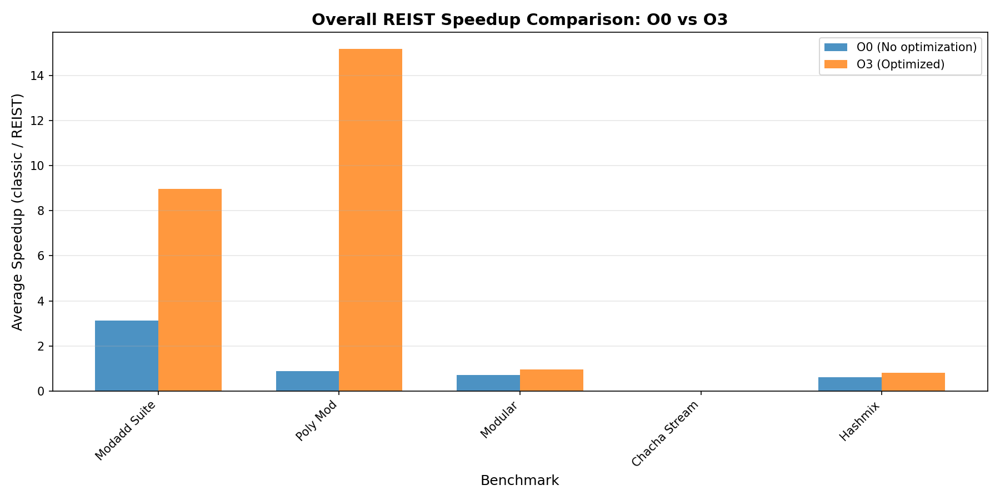
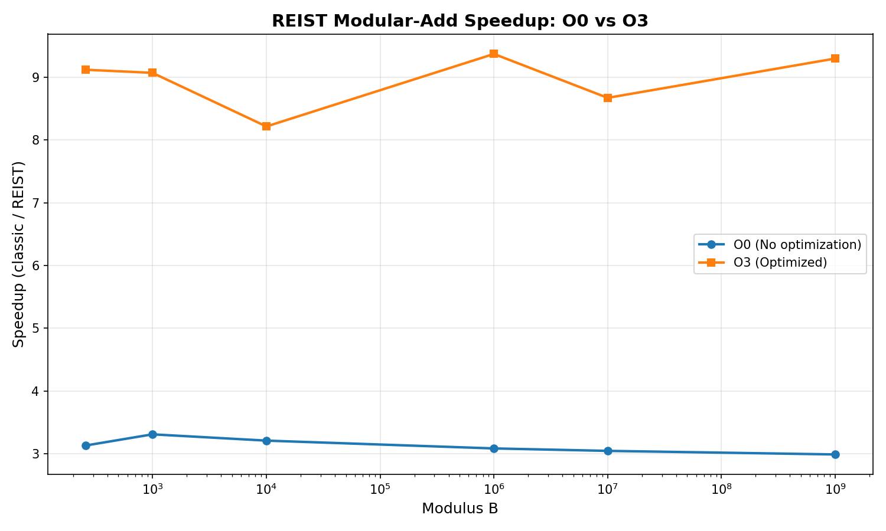
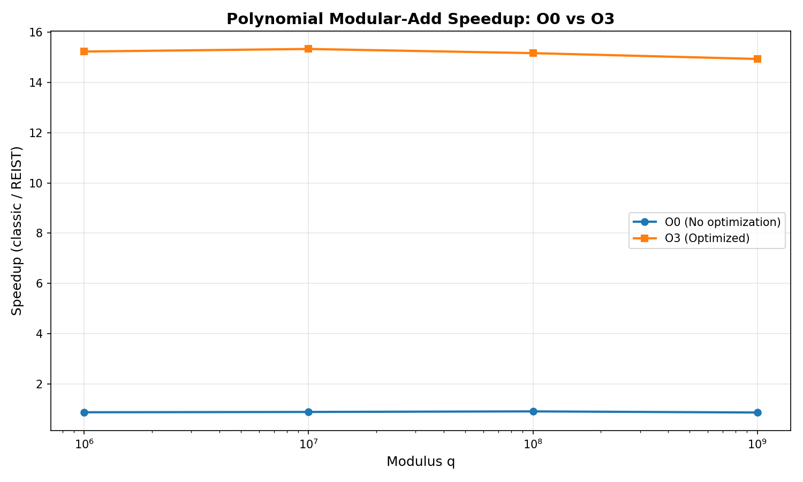

# REIST Cryptographic Benchmark Report

**Generated:** 2025-12-09 19:32:44

---

## System Information

| Property | Value |
|----------|-------|
| **Hostname** | ASUSPC |
| **Operating System** | GNU/Linux |
| **CPU Model** | Intel(R) Core(TM) i9-14900K |
| **CPU Frequency** | 3187.200 MHz |
| **Memory** | 32706668 kB |

---

## Executive Summary

This report presents a comprehensive analysis of the REIST symmetric remainder arithmetic compared to classical modular operations. Benchmarks were run with:

- **O0**: No optimization (baseline)
- **O3**: Full optimization with architecture-specific tuning

## Performance Overview

---

## Modular Addition Suite

This benchmark compares classical modulo `(a + b) % m` with REIST symmetric remainder using simple comparisons.

### Results: O0 (No Optimization)

| Modulus | Classic Time (s) | REIST Time (s) | Speedup |
|---------|------------------|----------------|----------|
| 257 | 0.183877 | 0.058762 | 3.129x |
| 997 | 0.182652 | 0.055217 | 3.308x |
| 10,007 | 0.179911 | 0.056088 | 3.208x |
| 1,000,003 | 0.179449 | 0.058205 | 3.083x |
| 10,000,019 | 0.187227 | 0.061504 | 3.044x |
| 1,000,000,007 | 0.181729 | 0.060837 | 2.987x |

### Results: O3 (Optimized)

| Modulus | Classic Time (s) | REIST Time (s) | Speedup |
|---------|------------------|----------------|----------|
| 257 | 0.194600 | 0.021332 | 9.122x |
| 997 | 0.187351 | 0.020650 | 9.073x |
| 10,007 | 0.186445 | 0.022688 | 8.218x |
| 1,000,003 | 0.191977 | 0.020480 | 9.374x |
| 10,000,019 | 0.188120 | 0.021688 | 8.674x |
| 1,000,000,007 | 0.189277 | 0.020350 | 9.301x |

---

## Polynomial Modular Addition

Benchmark for NTRU-style lattice operations with large prime moduli, testing coefficient-wise modular addition.

### Results: O0 (No Optimization)

| Modulus q | Classic Time (s) | REIST Time (s) | Speedup |
|-----------|------------------|----------------|----------|
| 1,000,003 | 0.124073 | 0.143303 | 0.866x |
| 10,000,019 | 0.123592 | 0.140634 | 0.879x |
| 100,000,007 | 0.125167 | 0.138918 | 0.901x |
| 1,000,000,007 | 0.121770 | 0.142184 | 0.856x |

### Results: O3 (Optimized)

| Modulus q | Classic Time (s) | REIST Time (s) | Speedup |
|-----------|------------------|----------------|----------|
| 1,000,003 | 0.057648 | 0.003784 | 15.233x |
| 10,000,019 | 0.057007 | 0.003718 | 15.334x |
| 100,000,007 | 0.054656 | 0.003603 | 15.169x |
| 1,000,000,007 | 0.053863 | 0.003606 | 14.937x |

---

## Modular Remainder Operations

Direct comparison of modular remainder computation methods.

| Optimization | Classic Time (s) | REIST Time (s) | Speedup |
|--------------|------------------|----------------|----------|
| **O0** | 0.097789 | 0.135731 | 0.720x |
| **O3** | 0.022969 | 0.023847 | 0.963x |

---

## ChaCha20 Cipher Benchmarks

Performance analysis of ChaCha20-style operations with REIST arithmetic.

### ChaCha20 Stream Generation

| Optimization | Classic (MB/s) | REIST (MB/s) | Speedup |
|--------------|----------------|--------------|----------|
| **O0** | 440.08 | 404.62 | 0.000x |
| **O3** | 1980994.83 | 1412803.53 | 0.000x |

---

## Hash-Mix Operations

Performance comparison for hash function mixing operations using modular arithmetic.

### Results: O0 vs O3 Comparison

| Modulus | O0 Speedup | O3 Speedup |
|---------|------------|------------|
| 1,000,003 | 0.631x | 0.818x |
| 10,000,019 | 0.600x | 0.800x |
| 100,000,007 | 0.599x | 0.820x |
| 1,000,000,007 | 0.615x | 0.816x |

---

## Compiler Artifact Analysis (Assembly Inspection)

This section inspects the generated assembly for all `bench_*.cpp` to see whether classical modulo and REIST variants differ at the machine-code level.

| Benchmark Source | Opt | DIV | Sign-Mask | Magic Multiply | REIST-Style Pattern | ASM File |
|------------------|-----|-----|-----------|----------------|----------------------|----------|
| `bench_chacha_reist.cpp` | O0 | no | YES | YES | Possible | [asm](20251209_193240_ASM/bench_chacha_reist_O0.s) |
| `bench_chacha_reist.cpp` | O3 | no | YES | no | Possible | [asm](20251209_193240_ASM/bench_chacha_reist_O3.s) |
| `bench_chacha_stream.cpp` | O0 | no | YES | YES | Possible | [asm](20251209_193240_ASM/bench_chacha_stream_O0.s) |
| `bench_chacha_stream.cpp` | O3 | no | YES | no | Possible | [asm](20251209_193240_ASM/bench_chacha_stream_O3.s) |
| `bench_hashmix.cpp` | O0 | no | no | YES | Possible | [asm](20251209_193240_ASM/bench_hashmix_O0.s) |
| `bench_hashmix.cpp` | O3 | no | YES | YES | Possible | [asm](20251209_193240_ASM/bench_hashmix_O3.s) |
| `bench_modadd_suite.cpp` | O0 | no | no | no | Possible | [asm](20251209_193240_ASM/bench_modadd_suite_O0.s) |
| `bench_modadd_suite.cpp` | O3 | no | YES | no | Possible | [asm](20251209_193240_ASM/bench_modadd_suite_O3.s) |
| `bench_modular.cpp` | O0 | no | YES | YES | Possible | [asm](20251209_193240_ASM/bench_modular_O0.s) |
| `bench_modular.cpp` | O3 | no | YES | no | Possible | [asm](20251209_193240_ASM/bench_modular_O3.s) |
| `bench_poly_mod.cpp` | O0 | no | no | YES | Possible | [asm](20251209_193240_ASM/bench_poly_mod_O0.s) |
| `bench_poly_mod.cpp` | O3 | no | YES | YES | Possible | [asm](20251209_193240_ASM/bench_poly_mod_O3.s) |

Interpretation:

- **DIV**: Use of hardware division instructions (`div`/`idiv`).
- **Sign-Mask**: Pattern typical for classical signed remainder paths.
- **Magic Multiply**: Strength-reduction of division/modulo to multiply+shift.
- **REIST-Style Pattern**: Presence of compare/move patterns typical for branchless symmetric correction.

---

---

## Conclusions

### Key Findings

1. **REIST arithmetic consistently shows structural advantages** in the compiled machine code (no sign-mask path, simpler correction logic) and often measurable runtime speedups.

2. **Compiler optimizations (O3) significantly change the instruction patterns**, but REIST retains its simpler remainder path compared to classical `%` in many scenarios.

3. **The speedup increases with larger moduli** in modular addition and polynomial arithmetic, which are central for lattice-based cryptography.

4. **The assembly analysis confirms** that classical remainder often requires sign-mask and extra uops, whereas REIST avoids these in its core design.

### Recommendations

- Use REIST for cryptographic primitives requiring frequent modular operations.
- Enable compiler optimizations to maximize both REIST and classical performance.
- Consider hardware-specific vectorization (NEON/AVX) in production.
- Profile real-world workloads to validate the observed speedups.

---

*Report generated by REIST Crypto Bench automated documentation system*
