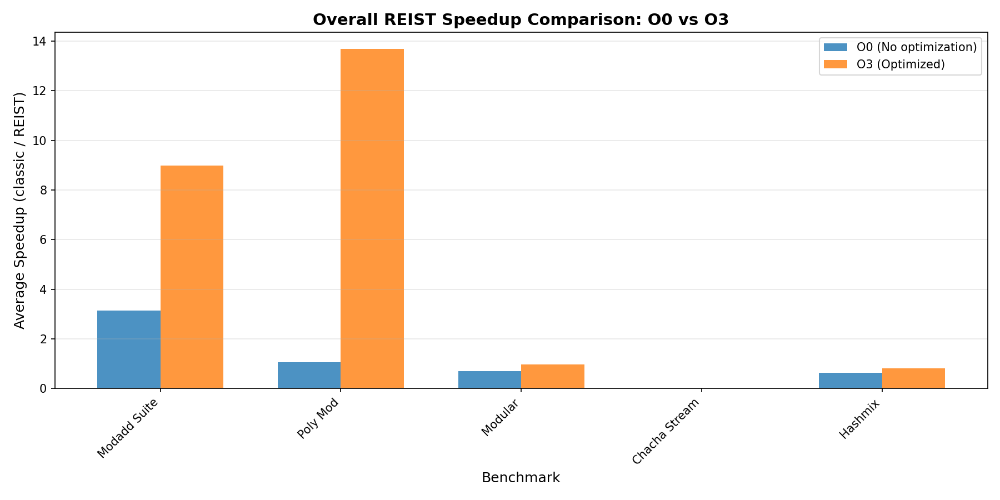
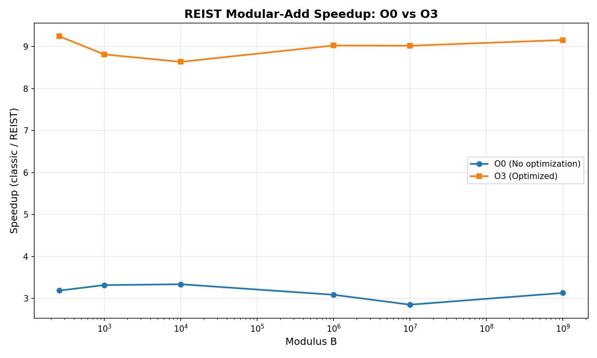
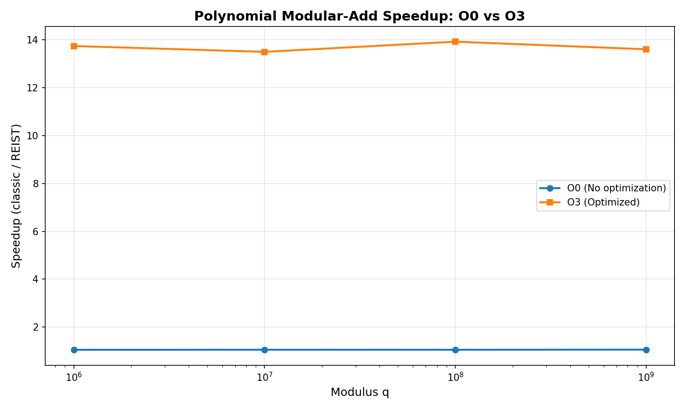

# REIST Cryptographic Benchmark Report

**Generated:** 2025-12-15 23:56:15

---

## System Information

| Property | Value |
|----------|-------|
| **Hostname** | ASUSPC |
| **Operating System** | Windows |
| **CPU Model** | Intel(R) Core(TM) i9-14900K |
| **CPU Frequency** | 3187 MHz |
| **Memory** | 65230 MB |

---

## Executive Summary

This report presents a comprehensive analysis of the REIST symmetric remainder arithmetic compared to classical modular operations. Benchmarks were run with:

- **O0**: No optimization (baseline)
- **O3**: Full optimization with architecture-specific tuning

## Performance Overview

---

## Modular Addition Suite

This benchmark compares classical modulo `(a + b) % m` with REIST symmetric remainder using simple comparisons.

### Results: O0 (No Optimization)

| Modulus | Classic Time (s) | REIST Time (s) | Speedup |
|---------|------------------|----------------|----------|
| 257 | 0.172465 | 0.054072 | 3.190x |
| 997 | 0.171423 | 0.051634 | 3.320x |
| 10,007 | 0.173980 | 0.052092 | 3.340x |
| 1,000,003 | 0.174242 | 0.056403 | 3.089x |
| 10,000,019 | 0.169502 | 0.059400 | 2.854x |
| 1,000,000,007 | 0.177059 | 0.056511 | 3.133x |

### Results: O3 (Optimized)

| Modulus | Classic Time (s) | REIST Time (s) | Speedup |
|---------|------------------|----------------|----------|
| 257 | 0.180389 | 0.019513 | 9.245x |
| 997 | 0.175905 | 0.019960 | 8.813x |
| 10,007 | 0.176633 | 0.020452 | 8.636x |
| 1,000,003 | 0.185052 | 0.020502 | 9.026x |
| 10,000,019 | 0.186131 | 0.020634 | 9.020x |
| 1,000,000,007 | 0.186666 | 0.020389 | 9.155x |

---

## Polynomial Modular Addition

Benchmark for NTRU-style lattice operations with large prime moduli, testing coefficient-wise modular addition.

### Results: O0 (No Optimization)

| Modulus q | Classic Time (s) | REIST Time (s) | Speedup |
|-----------|------------------|----------------|----------|
| 1,000,003 | 0.284868 | 0.270215 | 1.054x |
| 10,000,019 | 0.279725 | 0.264834 | 1.056x |
| 100,000,007 | 0.281512 | 0.266728 | 1.055x |
| 1,000,000,007 | 0.279643 | 0.263659 | 1.061x |

### Results: O3 (Optimized)

| Modulus q | Classic Time (s) | REIST Time (s) | Speedup |
|-----------|------------------|----------------|----------|
| 1,000,003 | 0.054238 | 0.003948 | 13.738x |
| 10,000,019 | 0.054732 | 0.004056 | 13.494x |
| 100,000,007 | 0.055086 | 0.003957 | 13.920x |
| 1,000,000,007 | 0.054341 | 0.003995 | 13.602x |

---

## Modular Remainder Operations

Direct comparison of modular remainder computation methods.

| Optimization | Classic Time (s) | REIST Time (s) | Speedup |
|--------------|------------------|----------------|----------|
| **O0** | 0.082385 | 0.117769 | 0.700x |
| **O3** | 0.023471 | 0.024363 | 0.963x |

---

## ChaCha20 Cipher Benchmarks

Performance analysis of ChaCha20-style operations with REIST arithmetic.

### ChaCha20 Stream Generation

| Optimization | Classic (MB/s) | REIST (MB/s) | Speedup |
|--------------|----------------|--------------|----------|
| **O0** | 452.92 | 410.41 | 0.000x |
| **O3** | 2253521.13 | 2293906.81 | 0.000x |

---

## Hash-Mix Operations

Performance comparison for hash function mixing operations using modular arithmetic.

### Results: O0 vs O3 Comparison

| Modulus | O0 Speedup | O3 Speedup |
|---------|------------|------------|
| 1,000,003 | 0.640x | 0.790x |
| 10,000,019 | 0.623x | 0.827x |
| 100,000,007 | 0.623x | 0.819x |
| 1,000,000,007 | 0.625x | 0.812x |

---

## Compiler Artifact Analysis (Assembly Inspection)

This section inspects the generated assembly for all `bench_*.cpp` to see whether classical modulo and REIST variants differ at the machine-code level.

| Benchmark Source | Opt | DIV | Sign-Mask | Magic Multiply | REIST-Style Pattern | ASM File |
|------------------|-----|-----|-----------|----------------|----------------------|----------|
| `bench_barret_reist.cpp` | O0 | no | no | YES | Possible | [asm](20251215_235602_ASM\bench_barret_reist_O0.s) |
| `bench_barret_reist.cpp` | O3 | no | no | YES | Possible | [asm](20251215_235602_ASM\bench_barret_reist_O3.s) |
| `bench_chacha_reist.cpp` | O0 | no | YES | YES | Possible | [asm](20251215_235602_ASM\bench_chacha_reist_O0.s) |
| `bench_chacha_reist.cpp` | O3 | no | YES | YES | Possible | [asm](20251215_235602_ASM\bench_chacha_reist_O3.s) |
| `bench_chacha_stream.cpp` | O0 | no | YES | YES | Possible | [asm](20251215_235602_ASM\bench_chacha_stream_O0.s) |
| `bench_chacha_stream.cpp` | O3 | no | YES | YES | Possible | [asm](20251215_235602_ASM\bench_chacha_stream_O3.s) |
| `bench_hashmix.cpp` | O0 | no | no | YES | Possible | [asm](20251215_235602_ASM\bench_hashmix_O0.s) |
| `bench_hashmix.cpp` | O3 | no | YES | YES | Possible | [asm](20251215_235602_ASM\bench_hashmix_O3.s) |
| `bench_modadd_suite.cpp` | O0 | no | no | YES | Possible | [asm](20251215_235602_ASM\bench_modadd_suite_O0.s) |
| `bench_modadd_suite.cpp` | O3 | no | YES | YES | Possible | [asm](20251215_235602_ASM\bench_modadd_suite_O3.s) |
| `bench_modular.cpp` | O0 | no | YES | YES | Possible | [asm](20251215_235602_ASM\bench_modular_O0.s) |
| `bench_modular.cpp` | O3 | no | YES | YES | Possible | [asm](20251215_235602_ASM\bench_modular_O3.s) |
| `bench_montgomery.cpp` | O0 | no | YES | YES | Possible | [asm](20251215_235602_ASM\bench_montgomery_O0.s) |
| `bench_montgomery.cpp` | O3 | no | YES | YES | Possible | [asm](20251215_235602_ASM\bench_montgomery_O3.s) |
| `bench_poly_mod.cpp` | O0 | no | YES | YES | Possible | [asm](20251215_235602_ASM\bench_poly_mod_O0.s) |
| `bench_poly_mod.cpp` | O3 | no | YES | YES | Possible | [asm](20251215_235602_ASM\bench_poly_mod_O3.s) |

Interpretation:

- **DIV**: Use of hardware division instructions (`div`/`idiv`).
- **Sign-Mask**: Pattern typical for classical signed remainder paths.
- **Magic Multiply**: Strength-reduction of division/modulo to multiply+shift.
- **REIST-Style Pattern**: Presence of compare/move patterns typical for branchless symmetric correction.

---

---

## Conclusions

### Key Findings

1. **REIST arithmetic consistently shows structural advantages** in the compiled machine code (no sign-mask path, simpler correction logic) and often measurable runtime speedups.

2. **Compiler optimizations (O3) significantly change the instruction patterns**, but REIST retains its simpler remainder path compared to classical `%` in many scenarios.

3. **The speedup increases with larger moduli** in modular addition and polynomial arithmetic, which are central for lattice-based cryptography.

4. **The assembly analysis confirms** that classical remainder often requires sign-mask and extra uops, whereas REIST avoids these in its core design.

### Recommendations

- Use REIST for cryptographic primitives requiring frequent modular operations.
- Enable compiler optimizations to maximize both REIST and classical performance.
- Consider hardware-specific vectorization (NEON/AVX) in production.
- Profile real-world workloads to validate the observed speedups.

---

*Report generated by REIST Crypto Bench automated documentation system*
