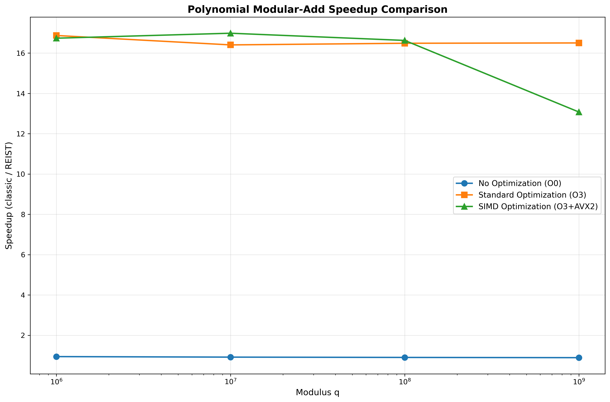

# REIST Cryptographic Benchmark Report

**Generated:** 2025-12-16 21:36:14

---

## System Information

| Property | Value |
|----------|-------|
| **Hostname** | macmini |
| **Operating System** | GNU/Linux |
| **CPU Model** | Intel(R) Core(TM) i7-4578U CPU @ 3.00GHz |
| **CPU Frequency** | 3404.004 MHz |
| **Memory** | 8004944 kB |

---

## Executive Summary

This report presents a comprehensive analysis of the REIST symmetric remainder arithmetic compared to classical modular operations. Benchmarks were run with:

- **O0**: No optimization (baseline)
- **O3**: Full optimization with architecture-specific tuning

## Performance Overview

---

## Modular Addition Suite

This benchmark compares classical modulo `(a + b) % m` with REIST symmetric remainder using simple comparisons.

### Results: O0 (No Optimization)

| Modulus | Classic Time (s) | REIST Time (s) | Speedup |
|---------|------------------|----------------|----------|
| 257 | 0.670541 | 0.139018 | 4.823x |
| 997 | 0.714102 | 0.132422 | 5.393x |
| 10,007 | 0.677849 | 0.147136 | 4.607x |
| 1,000,003 | 0.688435 | 0.124848 | 5.514x |
| 10,000,019 | 0.668367 | 0.129556 | 5.159x |
| 1,000,000,007 | 0.662994 | 0.129028 | 5.138x |

### Results: O3 (Optimized)

| Modulus | Classic Time (s) | REIST Time (s) | Speedup |
|---------|------------------|----------------|----------|
| 257 | 0.331878 | 0.046346 | 7.161x |
| 997 | 0.352838 | 0.052372 | 6.737x |
| 10,007 | 0.339828 | 0.043440 | 7.823x |
| 1,000,003 | 0.353539 | 0.040302 | 8.772x |
| 10,000,019 | 0.333061 | 0.040407 | 8.243x |
| 1,000,000,007 | 0.327659 | 0.040254 | 8.140x |

---

## Polynomial Modular Addition

Benchmark for NTRU-style lattice operations with large prime moduli, testing coefficient-wise modular addition.

### Results: O0 (No Optimization)

| Modulus q | Classic Time (s) | REIST Time (s) | Speedup |
|-----------|------------------|----------------|----------|
| 1,000,003 | 1.177645 | 1.249915 | 0.942x |
| 10,000,019 | 1.036020 | 1.130776 | 0.916x |
| 100,000,007 | 1.019046 | 1.130889 | 0.901x |
| 1,000,000,007 | 1.006250 | 1.131299 | 0.889x |

### Results: O3 (Optimized)

| Modulus q | Classic Time (s) | REIST Time (s) | Speedup |
|-----------|------------------|----------------|----------|
| 1,000,003 | 0.123073 | 0.007294 | 16.873x |
| 10,000,019 | 0.119241 | 0.007268 | 16.406x |
| 100,000,007 | 0.118964 | 0.007215 | 16.488x |
| 1,000,000,007 | 0.119017 | 0.007212 | 16.503x |

---

## Modular Remainder Operations

Direct comparison of modular remainder computation methods.

| Optimization | Classic Time (s) | REIST Time (s) | Speedup |
|--------------|------------------|----------------|----------|
| **O0** | 0.300410 | 0.440753 | 0.682x |
| **O3** | 0.094530 | 0.093467 | 1.011x |

---

## ChaCha20 Cipher Benchmarks

Performance analysis of ChaCha20-style operations with REIST arithmetic.

### ChaCha20 Stream Generation

| Optimization | Classic (MB/s) | REIST (MB/s) | Speedup |
|--------------|----------------|--------------|----------|
| **O0** | 88.08 | 77.12 | 0.000x |
| **O3** | 104705.70 | 107170.55 | 0.000x |

---

## Hash-Mix Operations

Performance comparison for hash function mixing operations using modular arithmetic.

### Results: O0 vs O3 Comparison

| Modulus | O0 Speedup | O3 Speedup |
|---------|------------|------------|
| 1,000,003 | 0.526x | 0.778x |
| 10,000,019 | 0.524x | 0.740x |
| 100,000,007 | 0.519x | 0.738x |
| 1,000,000,007 | 0.513x | 0.728x |

---

## Compiler Artifact Analysis (Assembly Inspection)

This section inspects the generated assembly for all `bench_*.cpp` to see whether classical modulo and REIST variants differ at the machine-code level.

| Benchmark Source | Opt | DIV | Sign-Mask | Magic Multiply | REIST-Style Pattern | ASM File |
|------------------|-----|-----|-----------|----------------|----------------------|----------|
| `bench_barret_reist.cpp` | O0 | no | no | YES | Possible | [asm](20251216_213557_ASM/bench_barret_reist_O0.s) |
| `bench_barret_reist.cpp` | O3 | no | no | YES | Possible | [asm](20251216_213557_ASM/bench_barret_reist_O3.s) |
| `bench_chacha_reist.cpp` | O0 | no | YES | YES | Possible | [asm](20251216_213557_ASM/bench_chacha_reist_O0.s) |
| `bench_chacha_reist.cpp` | O3 | no | YES | no | Possible | [asm](20251216_213557_ASM/bench_chacha_reist_O3.s) |
| `bench_chacha_stream.cpp` | O0 | no | YES | YES | Possible | [asm](20251216_213557_ASM/bench_chacha_stream_O0.s) |
| `bench_chacha_stream.cpp` | O3 | no | YES | no | Possible | [asm](20251216_213557_ASM/bench_chacha_stream_O3.s) |
| `bench_hashmix.cpp` | O0 | no | no | YES | Possible | [asm](20251216_213557_ASM/bench_hashmix_O0.s) |
| `bench_hashmix.cpp` | O3 | no | YES | YES | Possible | [asm](20251216_213557_ASM/bench_hashmix_O3.s) |
| `bench_modadd_suite.cpp` | O0 | no | no | no | Possible | [asm](20251216_213557_ASM/bench_modadd_suite_O0.s) |
| `bench_modadd_suite.cpp` | O3 | no | YES | no | Possible | [asm](20251216_213557_ASM/bench_modadd_suite_O3.s) |
| `bench_modular.cpp` | O0 | no | YES | YES | Possible | [asm](20251216_213557_ASM/bench_modular_O0.s) |
| `bench_modular.cpp` | O3 | no | YES | no | Possible | [asm](20251216_213557_ASM/bench_modular_O3.s) |
| `bench_montgomery.cpp` | O0 | no | YES | YES | Possible | [asm](20251216_213557_ASM/bench_montgomery_O0.s) |
| `bench_montgomery.cpp` | O3 | no | YES | YES | Possible | [asm](20251216_213557_ASM/bench_montgomery_O3.s) |
| `bench_poly_mod.cpp` | O0 | no | no | YES | Possible | [asm](20251216_213557_ASM/bench_poly_mod_O0.s) |
| `bench_poly_mod.cpp` | O3 | no | YES | YES | Possible | [asm](20251216_213557_ASM/bench_poly_mod_O3.s) |
| `bench_tree_reist.cpp` | O0 | no | YES | YES | Possible | [asm](20251216_213557_ASM/bench_tree_reist_O0.s) |
| `bench_tree_reist.cpp` | O3 | no | no | no | Possible | [asm](20251216_213557_ASM/bench_tree_reist_O3.s) |
| `bench_tree_reist_avx2.cpp` | O0 | no | no | YES | Possible | [asm](20251216_213557_ASM/bench_tree_reist_avx2_O0.s) |
| `bench_tree_reist_avx2.cpp` | O3 | no | YES | YES | Possible | [asm](20251216_213557_ASM/bench_tree_reist_avx2_O3.s) |

Interpretation:

- **DIV**: Use of hardware division instructions (`div`/`idiv`).
- **Sign-Mask**: Pattern typical for classical signed remainder paths.
- **Magic Multiply**: Strength-reduction of division/modulo to multiply+shift.
- **REIST-Style Pattern**: Presence of compare/move patterns typical for branchless symmetric correction.

---

---

## Conclusions

### Key Findings

1. **REIST arithmetic consistently shows structural advantages** in the compiled machine code (no sign-mask path, simpler correction logic) and often measurable runtime speedups.

2. **Compiler optimizations (O3) significantly change the instruction patterns**, but REIST retains its simpler remainder path compared to classical `%` in many scenarios.

3. **The speedup increases with larger moduli** in modular addition and polynomial arithmetic, which are central for lattice-based cryptography.

4. **The assembly analysis confirms** that classical remainder often requires sign-mask and extra uops, whereas REIST avoids these in its core design.

### Recommendations

- Use REIST for cryptographic primitives requiring frequent modular operations.
- Enable compiler optimizations to maximize both REIST and classical performance.
- Consider hardware-specific vectorization (NEON/AVX) in production.
- Profile real-world workloads to validate the observed speedups.

---

*Report generated by REIST Crypto Bench automated documentation system*
