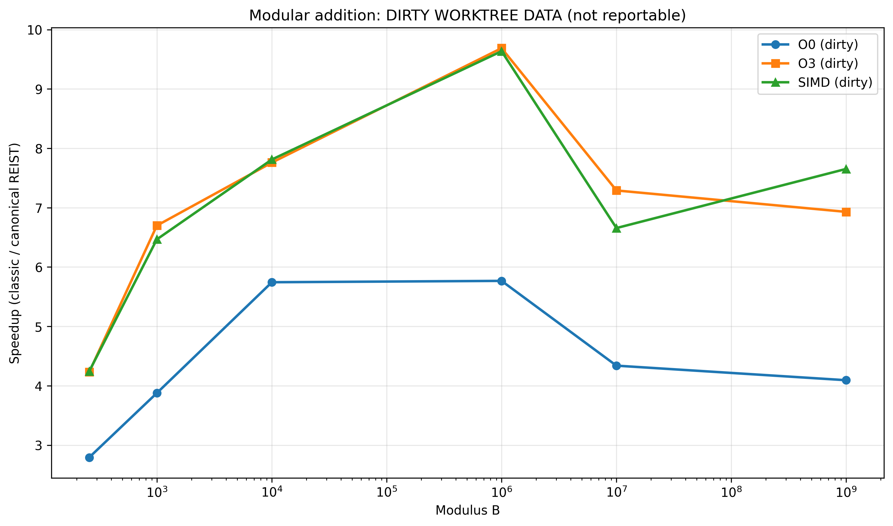
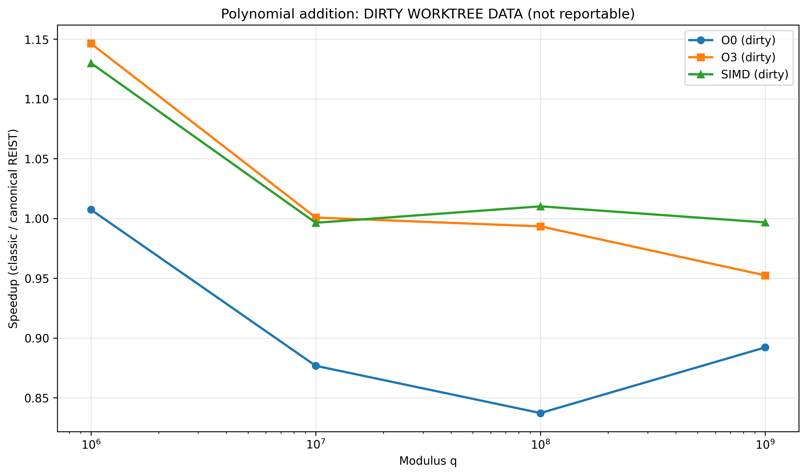

# REIST Cryptographic Benchmark Report

**Generated:** 2026-08-03 10:53:42

**Paper:** 2026 German edition, DOI [10.5281/zenodo.21206471](https://doi.org/10.5281/zenodo.21206471)

---

## System Information

| Property | Value |
|----------|-------|
| **Hostname** | ASUSPC |
| **Operating System** | Windows-11-10.0.26200-SP0 |
| **CPU Model** | Intel64 Family 6 Model 183 Stepping 1, GenuineIntel |
| **CPU Frequency** | 3187 MHz |
| **Memory** | 65230 MB |

---

## Verified Run Inputs

**NON-REPORTABLE DIRTY WORKTREE:** `--allow-dirty` was used. The exact dirty state is hash-bound across all profiles, but these timings must not be cited as paper evidence.

All inputs below were resolved relative to their runner manifest. Recorded stdout, stderr, and CSV artifacts passed SHA-256 verification. For sidecar-backed builds, the timed binary, compiler version, exact compile command/flags, source and header hashes were also reverified before this report was generated.

The build fields in this table describe the **timed binaries**, not the separate assembly recompilation later in this report.

| Profile | Session | Run ID | Repository commit/state | Build provenance | Timed compiler flags | Manifest | Verified artifacts |
|---|---|---|---|---|---|---|---|
| O0 | `20260803_105145_049176` | `20260803_105202_025944` | `39aa12d69ff4519f757ac8fc1be7cdf2aa492c02` (dirty; state `2b18e08fddfc...`) | make/O0; `g++`; verified sidecars | `-Iinclude -std=c++20 -Wall -Wextra -Wpedantic -Wconversion -Wsign-conversion -O0 -g -fno-tree-vectorize -MMD -MP` | [JSON](20260803_105202_025944_O0_MANIFEST.json) | [results_modadd_suite.csv](20260803_105202_025944_O0_artifacts/results_modadd_suite.csv) (`513d74e47764...`) [results_poly_mod.csv](20260803_105202_025944_O0_artifacts/results_poly_mod.csv) (`c1b50289fec7...`) |
| O3 | `20260803_105145_049176` | `20260803_105233_460387` | `39aa12d69ff4519f757ac8fc1be7cdf2aa492c02` (dirty; state `2b18e08fddfc...`) | make/O3; `g++`; verified sidecars | `-Iinclude -std=c++20 -Wall -Wextra -Wpedantic -Wconversion -Wsign-conversion -O3 -DNDEBUG -march=native -MMD -MP` | [JSON](20260803_105233_460387_O3_MANIFEST.json) | [results_modadd_suite.csv](20260803_105233_460387_O3_artifacts/results_modadd_suite.csv) (`0b33dc62185d...`) [results_poly_mod.csv](20260803_105233_460387_O3_artifacts/results_poly_mod.csv) (`346ee0c1d1e1...`) |
| SIMD | `20260803_105145_049176` | `20260803_105252_466864` | `39aa12d69ff4519f757ac8fc1be7cdf2aa492c02` (dirty; state `2b18e08fddfc...`) | make/SIMD; `g++`; verified sidecars | `-Iinclude -std=c++20 -Wall -Wextra -Wpedantic -Wconversion -Wsign-conversion -O3 -DNDEBUG -march=native -mavx2 -MMD -MP` | [JSON](20260803_105252_466864_SIMD_MANIFEST.json) | [results_modadd_suite.csv](20260803_105252_466864_SIMD_artifacts/results_modadd_suite.csv) (`bece5743619d...`) [results_poly_mod.csv](20260803_105252_466864_SIMD_artifacts/results_poly_mod.csv) (`45e5134e6d87...`) |

---

## Executive Summary

This report measures centered REIST-style correction in its documented target domain (persistent additive modular state) and includes neutral/negative controls. It does not claim a general replacement for division, Barrett, or Montgomery reduction. Benchmarks were run with:

- **O0**: No optimization (baseline)
- **O3**: Full optimization with architecture-specific tuning
- **SIMD**: O3 optimization with SIMD/NEON extensions

## Modular Addition Suite

This benchmark compares a classic persistent modulo update with a canonical centered state restored by one bounded correction. Inputs and state must satisfy the centered-range invariant.

### Results: O0 (No Optimization)

| Mode | Modulus | Classic Time (s) | REIST Time (s) | Speedup |
|---|---:|---:|---:|---:|
| compile-time template modulus | 257 | 0.070622 | 0.025288 | 2.793x |
| compile-time template modulus | 997 | 0.080616 | 0.020795 | 3.877x |
| compile-time template modulus | 10,007 | 0.108151 | 0.018829 | 5.744x |
| compile-time template modulus | 1,000,003 | 0.107235 | 0.018596 | 5.767x |
| compile-time template modulus | 10,000,019 | 0.080895 | 0.018646 | 4.338x |
| compile-time template modulus | 1,000,000,007 | 0.082452 | 0.020144 | 4.093x |

### Results: O3 (Optimized)

| Mode | Modulus | Classic Time (s) | REIST Time (s) | Speedup |
|---|---:|---:|---:|---:|
| compile-time template modulus | 257 | 0.066286 | 0.015672 | 4.230x |
| compile-time template modulus | 997 | 0.081267 | 0.012133 | 6.698x |
| compile-time template modulus | 10,007 | 0.089200 | 0.011495 | 7.760x |
| compile-time template modulus | 1,000,003 | 0.107153 | 0.011062 | 9.687x |
| compile-time template modulus | 10,000,019 | 0.080226 | 0.011005 | 7.290x |
| compile-time template modulus | 1,000,000,007 | 0.080485 | 0.011616 | 6.929x |

### Results: SIMD (O3 + SIMD/NEON)

| Mode | Modulus | Classic Time (s) | REIST Time (s) | Speedup |
|---|---:|---:|---:|---:|
| compile-time template modulus | 257 | 0.066238 | 0.015610 | 4.243x |
| compile-time template modulus | 997 | 0.079801 | 0.012342 | 6.466x |
| compile-time template modulus | 10,007 | 0.088834 | 0.011372 | 7.812x |
| compile-time template modulus | 1,000,003 | 0.106713 | 0.011075 | 9.636x |
| compile-time template modulus | 10,000,019 | 0.080434 | 0.012084 | 6.656x |
| compile-time template modulus | 1,000,000,007 | 0.084164 | 0.010998 | 7.653x |

---

## Polynomial Modular Addition

Coefficient-wise modular addition over arrays. This is an additive kernel measurement, not a complete lattice-cryptography benchmark.

### Results: O0 (No Optimization)

| Mode | Modulus q | Classic Time (s) | REIST Time (s) | Speedup |
|---|---:|---:|---:|---:|
| compile_time | 1,000,003 | 0.056706 | 0.056294 | 1.007x |
| compile_time | 10,000,019 | 0.053708 | 0.061258 | 0.877x |
| compile_time | 100,000,007 | 0.051501 | 0.061513 | 0.837x |
| compile_time | 1,000,000,007 | 0.051554 | 0.057787 | 0.892x |

### Results: O3 (Optimized)

| Mode | Modulus q | Classic Time (s) | REIST Time (s) | Speedup |
|---|---:|---:|---:|---:|
| compile_time | 1,000,003 | 0.005931 | 0.005174 | 1.146x |
| compile_time | 10,000,019 | 0.005437 | 0.005433 | 1.001x |
| compile_time | 100,000,007 | 0.005071 | 0.005104 | 0.993x |
| compile_time | 1,000,000,007 | 0.005137 | 0.005393 | 0.952x |

### Results: SIMD (O3 + SIMD/NEON)

| Mode | Modulus q | Classic Time (s) | REIST Time (s) | Speedup |
|---|---:|---:|---:|---:|
| compile_time | 1,000,003 | 0.005629 | 0.004981 | 1.130x |
| compile_time | 10,000,019 | 0.004960 | 0.004978 | 0.996x |
| compile_time | 100,000,007 | 0.004966 | 0.004916 | 1.010x |
| compile_time | 1,000,000,007 | 0.004963 | 0.004980 | 0.997x |

---

## Modular Remainder Operations

Negative/neutral control using independent full remainder computations; there is no persistent centered state to exploit.

| Optimization | Classic `%` (s) | Centered full remainder (s) | Ratio classic / centered |
|---|---:|---:|---:|
| **O0** | 0.037334 | 0.065739 | 0.568x |
| **O3** | 0.008853 | 0.009067 | 0.976x |
| **SIMD** | 0.009039 | 0.008833 | 1.023x |

---

## ARX Control (`bench_chacha_stream`)

ARX control. ChaCha20 uses power-of-two word arithmetic and provides no general-modulus REIST fast path; this is not a cipher-speedup claim.

### Stream-style control results

| Optimization | Standard add (MB/s) | Identity add (MB/s) | Ratio std / identity |
|---|---:|---:|---:|
| **O0** | 18.75 | 19.26 | 1.027x |
| **O3** | 754.76 | 749.22 | 0.993x |
| **SIMD** | 751.40 | 753.77 | 1.003x |

---

## Hash-Mix Operations

Negative control for multiplication/diffusion-heavy mixing. This workload does not satisfy the persistent centered-addition target pattern.

### Results: O0 vs O3 vs SIMD Comparison

| Modulus | O0 ratio | O3 ratio | SIMD ratio |
|---:|---:|---:|---:|
| 1,000,003 | 0.321x | 0.779x | 0.779x |
| 10,000,019 | 0.317x | 0.779x | 0.777x |
| 100,000,007 | 0.315x | 0.780x | 0.781x |
| 1,000,000,007 | 0.319x | 0.788x | 0.774x |

---

## Montgomery and Barrett Baselines

These validated programs separate the bounded centered-addition fast path from broader multiplication and reciprocal-reduction workloads. Rows from different subsections or dependency structures must not be treated as interchangeable.

### `bench_montgomery`

`REIST` appears only in the additive columns. The centered multiplication column is explicitly a full-`%` reference, not a REIST multiplication algorithm.

#### O0

| Modulus | Add classic | Add REIST | Add Montgomery | Mul classic | Mul centered `%` | Mul Montgomery | Full classic | Full Montgomery | Conversion delta |
|---:|---:|---:|---:|---:|---:|---:|---:|---:|---:|
| 257 | 0.082948 s | 0.092150 s | 0.027247 s | 0.087789 s | 0.114336 s | 0.052970 s | 0.237675 s | 0.296557 s | 24.77% |
| 65,537 | 0.080631 s | 0.094880 s | 0.019647 s | 0.086145 s | 0.139044 s | 0.050517 s | 0.239574 s | 0.301225 s | 25.73% |
| 1,000,003 | 0.084167 s | 0.094118 s | 0.024565 s | 0.086924 s | 0.153061 s | 0.050586 s | 0.238906 s | 0.298812 s | 25.08% |
| 10,000,019 | 0.080967 s | 0.093294 s | 0.020590 s | 0.090467 s | 0.153943 s | 0.051391 s | 0.237756 s | 0.304702 s | 28.16% |
| 1,000,000,007 | 0.080251 s | 0.096047 s | 0.024693 s | 0.087674 s | 0.151352 s | 0.050377 s | 0.242299 s | 0.297448 s | 22.76% |
| 1,000,000,000,039 | 0.081072 s | 0.091220 s | 0.021895 s | 0.088120 s | 0.152794 s | 0.051011 s | 0.241126 s | 0.295952 s | 22.74% |

#### O3

| Modulus | Add classic | Add REIST | Add Montgomery | Mul classic | Mul centered `%` | Mul Montgomery | Full classic | Full Montgomery | Conversion delta |
|---:|---:|---:|---:|---:|---:|---:|---:|---:|---:|
| 257 | 0.073055 s | 0.006195 s | 0.005848 s | 0.076448 s | 0.089351 s | 0.024024 s | 0.205595 s | 0.278770 s | 35.59% |
| 65,537 | 0.073241 s | 0.006208 s | 0.005957 s | 0.076668 s | 0.098835 s | 0.023799 s | 0.206362 s | 0.278585 s | 35.00% |
| 1,000,003 | 0.073631 s | 0.006472 s | 0.005849 s | 0.076573 s | 0.115818 s | 0.024005 s | 0.205957 s | 0.279211 s | 35.57% |
| 10,000,019 | 0.072799 s | 0.006267 s | 0.005887 s | 0.076569 s | 0.115493 s | 0.023717 s | 0.205285 s | 0.277538 s | 35.20% |
| 1,000,000,007 | 0.073861 s | 0.006894 s | 0.005969 s | 0.076837 s | 0.115179 s | 0.023792 s | 0.205366 s | 0.276328 s | 34.55% |
| 1,000,000,000,039 | 0.073944 s | 0.006181 s | 0.005904 s | 0.077350 s | 0.114703 s | 0.023858 s | 0.205175 s | 0.276816 s | 34.92% |

#### SIMD

| Modulus | Add classic | Add REIST | Add Montgomery | Mul classic | Mul centered `%` | Mul Montgomery | Full classic | Full Montgomery | Conversion delta |
|---:|---:|---:|---:|---:|---:|---:|---:|---:|---:|
| 257 | 0.073230 s | 0.006165 s | 0.005849 s | 0.076906 s | 0.089820 s | 0.023708 s | 0.205210 s | 0.275815 s | 34.41% |
| 65,537 | 0.073772 s | 0.006223 s | 0.005859 s | 0.077309 s | 0.096065 s | 0.024082 s | 0.204920 s | 0.277556 s | 35.45% |
| 1,000,003 | 0.073236 s | 0.006470 s | 0.005851 s | 0.076266 s | 0.114727 s | 0.023743 s | 0.205504 s | 0.276745 s | 34.67% |
| 10,000,019 | 0.073534 s | 0.006191 s | 0.005912 s | 0.077526 s | 0.115018 s | 0.023900 s | 0.205319 s | 0.276558 s | 34.70% |
| 1,000,000,007 | 0.073292 s | 0.006705 s | 0.005854 s | 0.077531 s | 0.114922 s | 0.023730 s | 0.206652 s | 0.276482 s | 33.79% |
| 1,000,000,000,039 | 0.073009 s | 0.006177 s | 0.005934 s | 0.075994 s | 0.115162 s | 0.023749 s | 0.204248 s | 0.278599 s | 36.40% |

### `bench_barret_reist`

The first table is one dependent additive stream. Optional AVX2 rows are eight independent streams and therefore a separate throughput experiment.

#### O0: one dependent stream

| Modulus | Classic `%` | REIST add | Barrett int64 | Barrett int32 | Classic / REIST |
|---:|---:|---:|---:|---:|---:|
| 257 | 0.035727 s | 0.089375 s | 0.112554 s | 0.046849 s | 0.400x |
| 65,537 | 0.035747 s | 0.086982 s | 0.100798 s | 0.045390 s | 0.411x |
| 1,000,003 | 0.035399 s | 0.093342 s | 0.097145 s | 0.046874 s | 0.379x |
| 10,000,019 | 0.035778 s | 0.094280 s | 0.097520 s | 0.053104 s | 0.379x |
| 1,000,000,007 | 0.035507 s | 0.090399 s | 0.086537 s | 0.033991 s | 0.393x |

#### O3: one dependent stream

| Modulus | Classic `%` | REIST add | Barrett int64 | Barrett int32 | Classic / REIST |
|---:|---:|---:|---:|---:|---:|
| 257 | 0.035469 s | 0.006425 s | 0.059476 s | 0.023751 s | 5.520x |
| 65,537 | 0.035433 s | 0.006426 s | 0.060970 s | 0.028473 s | 5.514x |
| 1,000,003 | 0.036353 s | 0.006449 s | 0.059459 s | 0.024443 s | 5.637x |
| 10,000,019 | 0.036039 s | 0.007422 s | 0.059754 s | 0.022590 s | 4.856x |
| 1,000,000,007 | 0.035385 s | 0.006379 s | 0.058876 s | 0.022816 s | 5.547x |

#### O3: eight independent AVX2 streams

| Modulus | REIST scalar | REIST AVX2 | Barrett scalar | Barrett AVX2 |
|---:|---:|---:|---:|---:|
| 257 | 0.003758 s | 0.001245 s | 0.007465 s | 0.007023 s |
| 65,537 | 0.003739 s | 0.001216 s | 0.008115 s | 0.007045 s |
| 1,000,003 | 0.003748 s | 0.001177 s | 0.007775 s | 0.007110 s |
| 10,000,019 | 0.004015 s | 0.001178 s | 0.007966 s | 0.007019 s |
| 1,000,000,007 | 0.003751 s | 0.001205 s | 0.005947 s | 0.007205 s |

#### SIMD: one dependent stream

| Modulus | Classic `%` | REIST add | Barrett int64 | Barrett int32 | Classic / REIST |
|---:|---:|---:|---:|---:|---:|
| 257 | 0.035561 s | 0.006340 s | 0.059273 s | 0.023849 s | 5.609x |
| 65,537 | 0.035706 s | 0.006469 s | 0.061659 s | 0.028505 s | 5.520x |
| 1,000,003 | 0.035971 s | 0.006450 s | 0.059417 s | 0.024219 s | 5.577x |
| 10,000,019 | 0.035346 s | 0.007318 s | 0.058962 s | 0.022720 s | 4.830x |
| 1,000,000,007 | 0.036063 s | 0.006437 s | 0.059465 s | 0.023037 s | 5.602x |

#### SIMD: eight independent AVX2 streams

| Modulus | REIST scalar | REIST AVX2 | Barrett scalar | Barrett AVX2 |
|---:|---:|---:|---:|---:|
| 257 | 0.003887 s | 0.001177 s | 0.007388 s | 0.007132 s |
| 65,537 | 0.003869 s | 0.001179 s | 0.007886 s | 0.007156 s |
| 1,000,003 | 0.003770 s | 0.001177 s | 0.007695 s | 0.006978 s |
| 10,000,019 | 0.004480 s | 0.001186 s | 0.008357 s | 0.007109 s |
| 1,000,000,007 | 0.004075 s | 0.001239 s | 0.005970 s | 0.007205 s |

---

## Compiler Artifact Analysis (Assembly Inspection)

This section inspects only explicitly manifested arithmetic functions. Timing, I/O, parsing, allocation, and unrelated functions in the same translation unit are excluded from classification.

This is a **separate assembly recompilation**, not provenance for the timed binaries; their compiler and exact flags are recorded in the Verified Run Inputs table above. Timed: `C:/msys64/mingw64/bin/g++.exe`; assembly: `g++` (different compiler selection).

Build and analysis metadata: [JSON manifest](20260803_105312_126710_ASM/build_manifest.json)

| Source | Opt | Emitted kernel | Role | DIV | Sign-mask | Multiply+shift candidate | Centered-correction candidate | ASM |
|---|---|---|---|---|---|---|---|---|
| `bench_barret_reist.cpp` | O0 | `(anonymous namespace)::BarrettContext32::reduce_centered(int) const` | Barrett | no | no | no | no | [asm](20260803_105312_126710_ASM/bench_barret_reist_O0.s) |
| `bench_barret_reist.cpp` | O0 | `(anonymous namespace)::BarrettContext64::reduce_centered(long long) const` | Barrett | no | no | no | no | [asm](20260803_105312_126710_ASM/bench_barret_reist_O0.s) |
| `bench_barret_reist.cpp` | O0 | `(anonymous namespace)::classic_modadd(long long, long long, long long)` | classic | YES | no | no | no | [asm](20260803_105312_126710_ASM/bench_barret_reist_O0.s) |
| `bench_barret_reist.cpp` | O3 | not emitted/inlined (`classic_modadd, BarrettContext64::reduce_centered, BarrettContext32::reduce_centered, barrett_reduce32_avx2, reist_add_avx2`) | - | - | - | - | - | [asm](20260803_105312_126710_ASM/bench_barret_reist_O3.s) |
| `bench_hashmix.cpp` | O0 | `(anonymous namespace)::centered_step(long long, long long)` | centered | no | no | no | no | [asm](20260803_105312_126710_ASM/bench_hashmix_O0.s) |
| `bench_hashmix.cpp` | O0 | `(anonymous namespace)::classic_step(unsigned long long, unsigned long long)` | classic | YES | no | no | no | [asm](20260803_105312_126710_ASM/bench_hashmix_O0.s) |
| `bench_hashmix.cpp` | O3 | not emitted/inlined (`classic_step, centered_step`) | - | - | - | - | - | [asm](20260803_105312_126710_ASM/bench_hashmix_O3.s) |
| `bench_modadd_suite.cpp` | O0 | `classic_modadd_const_1000000007` | classic | no | no | candidate | no | [asm](20260803_105312_126710_ASM/bench_modadd_suite_O0.s) |
| `bench_modadd_suite.cpp` | O0 | `classic_modadd_const_10000019` | classic | no | no | candidate | no | [asm](20260803_105312_126710_ASM/bench_modadd_suite_O0.s) |
| `bench_modadd_suite.cpp` | O0 | `classic_modadd_const_1000003` | classic | no | no | candidate | no | [asm](20260803_105312_126710_ASM/bench_modadd_suite_O0.s) |
| `bench_modadd_suite.cpp` | O0 | `classic_modadd_const_10007` | classic | no | no | candidate | no | [asm](20260803_105312_126710_ASM/bench_modadd_suite_O0.s) |
| `bench_modadd_suite.cpp` | O0 | `classic_modadd_const_257` | classic | no | no | candidate | no | [asm](20260803_105312_126710_ASM/bench_modadd_suite_O0.s) |
| `bench_modadd_suite.cpp` | O0 | `classic_modadd_const_997` | classic | no | no | candidate | no | [asm](20260803_105312_126710_ASM/bench_modadd_suite_O0.s) |
| `bench_modadd_suite.cpp` | O0 | `classic_modadd_runtime_kernel` | classic | YES | no | no | no | [asm](20260803_105312_126710_ASM/bench_modadd_suite_O0.s) |
| `bench_modadd_suite.cpp` | O0 | `reist_modadd_const_1000000007` | REIST | no | no | no | no | [asm](20260803_105312_126710_ASM/bench_modadd_suite_O0.s) |
| `bench_modadd_suite.cpp` | O0 | `reist_modadd_const_10000019` | REIST | no | no | no | no | [asm](20260803_105312_126710_ASM/bench_modadd_suite_O0.s) |
| `bench_modadd_suite.cpp` | O0 | `reist_modadd_const_1000003` | REIST | no | no | no | no | [asm](20260803_105312_126710_ASM/bench_modadd_suite_O0.s) |
| `bench_modadd_suite.cpp` | O0 | `reist_modadd_const_10007` | REIST | no | no | no | no | [asm](20260803_105312_126710_ASM/bench_modadd_suite_O0.s) |
| `bench_modadd_suite.cpp` | O0 | `reist_modadd_const_257` | REIST | no | no | no | no | [asm](20260803_105312_126710_ASM/bench_modadd_suite_O0.s) |
| `bench_modadd_suite.cpp` | O0 | `reist_modadd_const_997` | REIST | no | no | no | no | [asm](20260803_105312_126710_ASM/bench_modadd_suite_O0.s) |
| `bench_modadd_suite.cpp` | O0 | `reist_modadd_runtime_kernel` | REIST | no | no | no | no | [asm](20260803_105312_126710_ASM/bench_modadd_suite_O0.s) |
| `bench_modadd_suite.cpp` | O3 | `classic_modadd_const_1000000007` | classic | no | no | candidate | no | [asm](20260803_105312_126710_ASM/bench_modadd_suite_O3.s) |
| `bench_modadd_suite.cpp` | O3 | `classic_modadd_const_10000019` | classic | no | no | candidate | no | [asm](20260803_105312_126710_ASM/bench_modadd_suite_O3.s) |
| `bench_modadd_suite.cpp` | O3 | `classic_modadd_const_1000003` | classic | no | no | candidate | no | [asm](20260803_105312_126710_ASM/bench_modadd_suite_O3.s) |
| `bench_modadd_suite.cpp` | O3 | `classic_modadd_const_10007` | classic | no | YES | candidate | no | [asm](20260803_105312_126710_ASM/bench_modadd_suite_O3.s) |
| `bench_modadd_suite.cpp` | O3 | `classic_modadd_const_257` | classic | no | no | candidate | no | [asm](20260803_105312_126710_ASM/bench_modadd_suite_O3.s) |
| `bench_modadd_suite.cpp` | O3 | `classic_modadd_const_997` | classic | no | no | candidate | no | [asm](20260803_105312_126710_ASM/bench_modadd_suite_O3.s) |
| `bench_modadd_suite.cpp` | O3 | `classic_modadd_runtime_kernel` | classic | YES | no | no | no | [asm](20260803_105312_126710_ASM/bench_modadd_suite_O3.s) |
| `bench_modadd_suite.cpp` | O3 | `reist_modadd_const_1000000007` | REIST | no | no | no | no | [asm](20260803_105312_126710_ASM/bench_modadd_suite_O3.s) |
| `bench_modadd_suite.cpp` | O3 | `reist_modadd_const_10000019` | REIST | no | no | no | no | [asm](20260803_105312_126710_ASM/bench_modadd_suite_O3.s) |
| `bench_modadd_suite.cpp` | O3 | `reist_modadd_const_1000003` | REIST | no | no | no | no | [asm](20260803_105312_126710_ASM/bench_modadd_suite_O3.s) |
| `bench_modadd_suite.cpp` | O3 | `reist_modadd_const_10007` | REIST | no | no | no | no | [asm](20260803_105312_126710_ASM/bench_modadd_suite_O3.s) |
| `bench_modadd_suite.cpp` | O3 | `reist_modadd_const_257` | REIST | no | no | no | no | [asm](20260803_105312_126710_ASM/bench_modadd_suite_O3.s) |
| `bench_modadd_suite.cpp` | O3 | `reist_modadd_const_997` | REIST | no | no | no | no | [asm](20260803_105312_126710_ASM/bench_modadd_suite_O3.s) |
| `bench_modadd_suite.cpp` | O3 | `reist_modadd_runtime_kernel` | REIST | no | no | no | candidate | [asm](20260803_105312_126710_ASM/bench_modadd_suite_O3.s) |
| `bench_modular.cpp` | O0 | `(anonymous namespace)::centered_checksum(std::vector<long long, std::allocator<long long> > const&, long long)` | centered | no | no | no | no | [asm](20260803_105312_126710_ASM/bench_modular_O0.s) |
| `bench_modular.cpp` | O0 | `(anonymous namespace)::classic_checksum(std::vector<long long, std::allocator<long long> > const&, long long)` | classic | no | no | no | no | [asm](20260803_105312_126710_ASM/bench_modular_O0.s) |
| `bench_modular.cpp` | O3 | not emitted/inlined (`classic_checksum, centered_checksum`) | - | - | - | - | - | [asm](20260803_105312_126710_ASM/bench_modular_O3.s) |
| `bench_montgomery.cpp` | O0 | `(anonymous namespace)::MontgomeryContext::add(unsigned long long, unsigned long long) const` | Montgomery | no | no | no | no | [asm](20260803_105312_126710_ASM/bench_montgomery_O0.s) |
| `bench_montgomery.cpp` | O0 | `(anonymous namespace)::MontgomeryContext::multiply(unsigned long long, unsigned long long) const` | Montgomery | no | no | no | no | [asm](20260803_105312_126710_ASM/bench_montgomery_O0.s) |
| `bench_montgomery.cpp` | O0 | `(anonymous namespace)::centered_modmul_reference(long long, long long, long long)` | centered | no | YES | no | no | [asm](20260803_105312_126710_ASM/bench_montgomery_O0.s) |
| `bench_montgomery.cpp` | O0 | `(anonymous namespace)::classic_modadd(unsigned long long, unsigned long long, unsigned long long)` | classic | no | no | no | no | [asm](20260803_105312_126710_ASM/bench_montgomery_O0.s) |
| `bench_montgomery.cpp` | O0 | `(anonymous namespace)::classic_modmul(unsigned long long, unsigned long long, unsigned long long)` | classic | no | no | no | no | [asm](20260803_105312_126710_ASM/bench_montgomery_O0.s) |
| `bench_montgomery.cpp` | O3 | not emitted/inlined (`classic_modadd, classic_modmul, centered_modmul_reference, MontgomeryContext::add, MontgomeryContext::multiply`) | - | - | - | - | - | [asm](20260803_105312_126710_ASM/bench_montgomery_O3.s) |
| `bench_poly_mod.cpp` | O0 | `classic_poly_const_1000000007` | classic | no | YES | candidate | no | [asm](20260803_105312_126710_ASM/bench_poly_mod_O0.s) |
| `bench_poly_mod.cpp` | O0 | `classic_poly_const_100000007` | classic | no | YES | candidate | no | [asm](20260803_105312_126710_ASM/bench_poly_mod_O0.s) |
| `bench_poly_mod.cpp` | O0 | `classic_poly_const_10000019` | classic | no | YES | candidate | no | [asm](20260803_105312_126710_ASM/bench_poly_mod_O0.s) |
| `bench_poly_mod.cpp` | O0 | `classic_poly_const_1000003` | classic | no | YES | candidate | no | [asm](20260803_105312_126710_ASM/bench_poly_mod_O0.s) |
| `bench_poly_mod.cpp` | O0 | `classic_poly_runtime_kernel` | classic | YES | no | no | no | [asm](20260803_105312_126710_ASM/bench_poly_mod_O0.s) |
| `bench_poly_mod.cpp` | O0 | `reist_poly_const_1000000007` | REIST | no | no | no | no | [asm](20260803_105312_126710_ASM/bench_poly_mod_O0.s) |
| `bench_poly_mod.cpp` | O0 | `reist_poly_const_100000007` | REIST | no | no | no | no | [asm](20260803_105312_126710_ASM/bench_poly_mod_O0.s) |
| `bench_poly_mod.cpp` | O0 | `reist_poly_const_10000019` | REIST | no | no | no | no | [asm](20260803_105312_126710_ASM/bench_poly_mod_O0.s) |
| `bench_poly_mod.cpp` | O0 | `reist_poly_const_1000003` | REIST | no | no | no | no | [asm](20260803_105312_126710_ASM/bench_poly_mod_O0.s) |
| `bench_poly_mod.cpp` | O0 | `reist_poly_runtime_kernel` | REIST | no | no | no | no | [asm](20260803_105312_126710_ASM/bench_poly_mod_O0.s) |
| `bench_poly_mod.cpp` | O3 | `classic_poly_const_1000000007` | classic | no | YES | candidate | no | [asm](20260803_105312_126710_ASM/bench_poly_mod_O3.s) |
| `bench_poly_mod.cpp` | O3 | `classic_poly_const_100000007` | classic | no | YES | candidate | no | [asm](20260803_105312_126710_ASM/bench_poly_mod_O3.s) |
| `bench_poly_mod.cpp` | O3 | `classic_poly_const_10000019` | classic | no | YES | candidate | no | [asm](20260803_105312_126710_ASM/bench_poly_mod_O3.s) |
| `bench_poly_mod.cpp` | O3 | `classic_poly_const_1000003` | classic | no | YES | candidate | no | [asm](20260803_105312_126710_ASM/bench_poly_mod_O3.s) |
| `bench_poly_mod.cpp` | O3 | `classic_poly_runtime_kernel` | classic | YES | no | no | no | [asm](20260803_105312_126710_ASM/bench_poly_mod_O3.s) |
| `bench_poly_mod.cpp` | O3 | `reist_poly_const_1000000007` | REIST | no | no | no | candidate | [asm](20260803_105312_126710_ASM/bench_poly_mod_O3.s) |
| `bench_poly_mod.cpp` | O3 | `reist_poly_const_100000007` | REIST | no | no | no | candidate | [asm](20260803_105312_126710_ASM/bench_poly_mod_O3.s) |
| `bench_poly_mod.cpp` | O3 | `reist_poly_const_10000019` | REIST | no | no | no | candidate | [asm](20260803_105312_126710_ASM/bench_poly_mod_O3.s) |
| `bench_poly_mod.cpp` | O3 | `reist_poly_const_1000003` | REIST | no | no | no | candidate | [asm](20260803_105312_126710_ASM/bench_poly_mod_O3.s) |
| `bench_poly_mod.cpp` | O3 | `reist_poly_runtime_kernel` | REIST | no | no | no | candidate | [asm](20260803_105312_126710_ASM/bench_poly_mod_O3.s) |

Interpretation:

- **DIV** recognizes x86 `div`/`idiv` suffix variants and AArch64 `sdiv`/`udiv`.
- **Sign-mask** requires an arithmetic right shift by exactly 31 or 63 bits.
- **Multiply+shift** is only a strength-reduction candidate; it is not proof that a modulo operation caused the sequence.
- **Centered correction** requires a REIST/centered kernel name plus compare, conditional selection, and add/sub instructions.
- Missing kernels may have been inlined or optimized away; no whole-file inference replaces them.
- Assembly shape does not by itself establish constant-time or side-channel behavior.

---

---

## Conclusions

### Key Findings

1. **Persistent centered additions are the target case.** Their one-correction loop can avoid a remainder operation after initial centering.

2. **Controls define the boundary.** Full unrelated remainders, ARX code, hash mixing, and multiplication-heavy paths need not improve.

3. **Compiler evidence is kernel-specific.** DIV, sign-mask, multiply/shift, and correction candidates are reported only for named emitted functions.

4. **Results are configuration-specific.** Compiler, flags, source hash, platform, and missing/inlined kernels are recorded in the build manifest.

### Recommendations

- Use centered correction only where the modulus is phase-stable and operands remain centered.
- Keep Montgomery/Barrett baselines for multiplication-dominated kernels.
- Validate scalar, SIMD, and hardware paths against the same canonical tie convention.
- Profile the complete application before drawing cryptographic performance conclusions.

---

*Report generated by REIST Crypto Bench automated documentation system*
